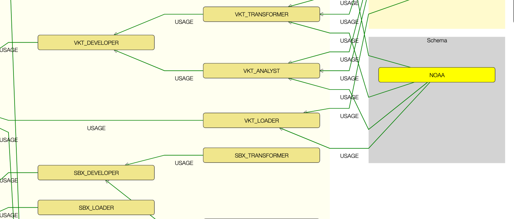
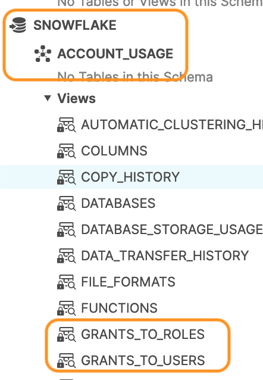
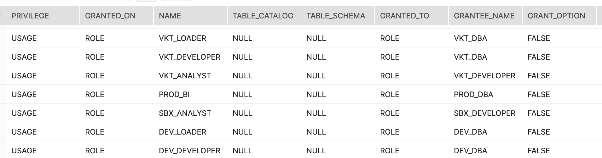
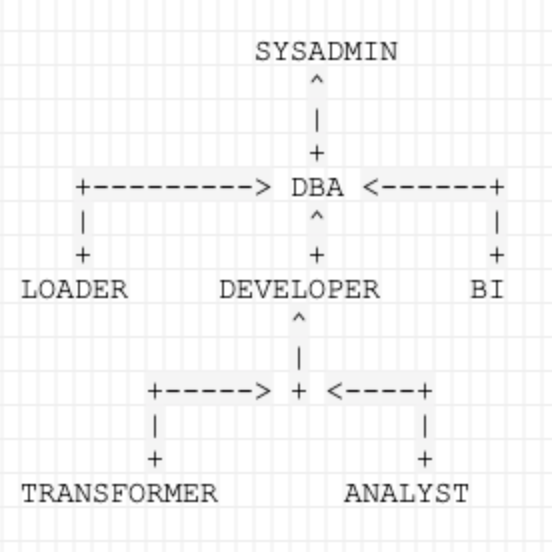
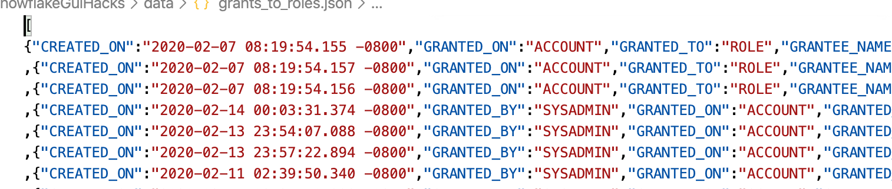

# Visualizing snowflake roles hierarchy


## Overview
Snowflake provides granular control over access to objects — who can access what objects, what operations can be performed on those objects, and who can create or alter access control policies.

[Ref: Access control framework](https://docs.snowflake.net/manuals/user-guide/security-access-control-overview.html#access-control-framework)

All objects in Snowflake are secured, in order to access these the user needs to have 
 - Role
 - And appropriate action privilege (Ex: Usage, Modify, Monitor Usage etc..)

[Ref: Securable Object](https://docs.snowflake.net/manuals/user-guide/security-access-control-overview.html#securable-objects)

By default snowflake offers the following [default roles](https://docs.snowflake.net/manuals/user-guide/security-access-control-overview.html#system-defined-roles):
- AccountAdmin
- SecurityAdmin
- Sysadmin
- Public

These would not suffice for an implementation, we end up defining [custom roles](https://docs.snowflake.net/manuals/user-guide/security-access-control-overview.html#custom-roles). Snowflake's recomendation is to create a hierarchy of custom roles, with the top-most custom role assigned to the system role SYSADMIN. That way, the system administrators will be able to manage all warehouses and all databases, while maintaining management of user and roles restricted to users granted the SECURITYADMIN or ACCOUNTADMIN roles.

## Role Hierarchy
A role hierarchy is created via the Grant statement, for ex: 
```sql 
GRANT ROLE DEVELOPER TO ROLE DBA;
```
Information of the roles and privilege can be obtained via
- [Show Grants](https://docs.snowflake.net/manuals/sql-reference/sql/show-grants.html)
- [Show Roles](https://docs.snowflake.net/manuals/sql-reference/sql/show-roles.html)

I had originally provided a way of Capturing the users, roles ,grants into a table in this [Blog: How to Capture Snowflake Users, Roles, and Grants Into a Table](https://community.snowflake.com/s/article/How-to-Capture-Snowflake-Users-Roles-and-Grants-Into-a-Table). Things have changed, Snowflake now provides views which provides these functionality

### Views presenting relations between roles,grants and users

- [GRANTS_TO_ROLE](https://docs.snowflake.net/manuals/sql-reference/account-usage/grants_to_roles.html)
- GRANTS TO USER



The data is now readily queryable and results can be available as table results


### Visualization of role hierarchy
There is a natural hierarchy-ness in the data, a quick way of understanding is presenting this in the form a Graph Network.

I am not a UI/UX expert; but the way i would prefer the graph network to display is to clearly lay out the roles, objects as nodes and the privilege to those objects as lineage. After working my ways through Sanskey diagrams ,Chord diagrams i finally landed on the [Dagre](https://github.com/dagrejs/dagre-d3/wiki) form.

#### Scenario
In the below scenario we have a single Snowflake account, with mutiple environment configuration. Each environment ,ex: DEV, SBX, PRD, is prefixed in the name of the 
objects ex: role DEV_DBA, database SBX_RAW.


We have defined the following custom role hierarchy defined.



Other objects like database, warehouse etc gets also defined. Roles are assigned 
appropriate privileges.

#### Data extraction
As mentioned, the roles & grants are available via the GRANTS_TO_ROLE view, while there are many ways of extracting & presenting the data, I have adopted a simple approach. For now I've used the below query to get the roles as JSON documents and store them locally in a file : [data/grants_to_roles.json](data/grants_to_roles.json). 

```sql
 select to_json(OBJECT_CONSTRUCT(*))
 from snowflake.account_usage.grants_to_roles
 where deleted_on is null
 order by privilege;
```

For now, I did a manual edit to set the rows into a JSON array.


#### Graphing
This being a prototype, I've used the default settings and configuration of Dagre-D3 to layout the graph. You can view a [demo](roles.html).


The prototype achieves the following
 - Lays out the roles and thier hieararchy in a tree
 - The privileges are mapped as edges, so you can see how the role is connected to an object (warehouse, databases, schema)
 - The ownership privilege was filtered out; as it caused too much noise in the graph.
 - The objects are also grouped into a bounding box.
 
##### Improvements
This demo is just a prototype. The graph is not very responsive other than zoom-in & zoom-out. You could enhance the code to adopt the following functionalities:
- When a specific object is choosen, highlight all the neighbouring nodes
- Filter
- Tooltips
- Append with GRANTS_TO_USERS view dataset

And ofcourse format the graph pretty. Prettifying the graph is a complex science, as explained in this [Blog: Lessons Learned from Creating a Custom Graph Visualization in React](https://medium.com/splunk-engineering/lessons-learned-from-creating-a-custom-graph-visualization-in-react-9a667ba799d1
). Hence I leave this upto the implementor and thier audience.

